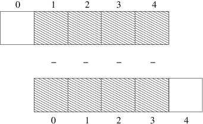

#Data wrangling with Python / Numpy


## Introduction

Python is a _simple general-purpose programming language_. As such, Python is not tied to a specific task or discipline, but is widely used for processing and analysing text, numbers, images, building websites and applications, and increasingly in machine learning and data science. 

Python was created by Guido van Rossum in the early 1990s, its namesake being Monty Python's Flying Circus. It is now developed by a large team of volunteers and is freely available from the Python Software Foundation. That's right, Python is free! More than that, Python has a strong ties to the open source movement. This means there is a culture of sharing and support within the Python 'ecosystem'.

Python, Matlab, or R (or Java, C++, ...)? There are a lot of programming languages, and many tasks - such as the one demonstrated in this chapter - can be completed equally well in all of them. So how to decide? In our group, some researchers chose Python because it was stronger in discipline-specific Libraries than any of its competetors (for instance Neuroscience, Geophysics). However, for those of us who had also dabled in other languages first (e.g. Matlab, R), we found that there was litte 'wasted' effort in switching. Many core concepts extend across all languages, not to mention the more ephemeral skill of 'thinking like a programmer'.

Finally, the introduction should end with a contents page listing how the rest of the chapter will flow.


### Learning Objectives:

In this chapter we're going to look a Python library called Numpy (numeric Python). A library is group of tools (code) designed to assist a common purpose, yet somehow outside the `core` capabilities of the Langauge. Numpy provides the ability to work with structured groups of numbers (arrays). Depending on the situation, these could represent individual measurements, vectors, time series, tables, grids, matrices, etc.

Using Numpy we're going to tackle a simple data science problem, yet one that has some profound implications. If you are new to Python and Numpy, our main suggestion is to __try to understand the data science problem__. Hopefully, if you have a good handle on the problem itself, the utility and efficiency of Python / Numpy will be apparent.

While you won't finish this chapter a fully-fledged Python programmer, we hope that you will get a sense of the 'flavour' of how Python works. Don't get too concerned about understanding _every_ piece of code that's written, but instead try to focus on how the programming approach to the __data science problem__ differs from a workflow you might develop using a spreadsheet or application (for instance Excel or SPSS). 

Necessarily, we will introduce some extraneous concepts and terms, that we don't have time to fully-develop or explore . In the Summary section, we provide links to material to help you master these subjects later on.

By the end of this chapter you will learn:

1. How to import, wrangle, and query structured, numeric data, using Python/Numpy.
2. The 'flavour' of using Python/Numpy for a data science workflow.


### glossary

* Library (e.g Numpy)
   * consider this a set of functions that are not native to the programming language (Python), nut have to be _imported_ separately - much like a plugin for a GUI-based software.
* Jupyter notebook
   * a web application that allows you to create and share documents that contain live code, equations, visualizations and explanatory text.
* Variable
   * a chunk of memory and an associated name / identifier, which contains some quantity of information referred to as a value.
* Function
   * a piece of organized, reusable code that is used to perform a single, related action
* Boolean
   * In most computer programming languages, a Boolean data type is a data type with only two possible values: true or false.
* Element
   * if you think of a Numpy array as a table, each cell is called an element. 
* index
   * an index is the set of numbers that are used to identify each element, there is one number per dimension.  
* slice
   * a slice is the Numpy term for returning a subset of an array usinf slicing-syntax and appropriate indices. 


### A data science problem

Our example looks at a real (data) science problem. In fact, very shortly we are going to to endeavour to _falsify_ a hypothesis. We'll try to show that there _are_ predictable patterns in day-to-day stockmarket data, a discovery which would contradict the _efficient market hypothesis_. 

There are a number of statistical analyses relavent to this problem. Howevery our workflow will simply try to determine __what is the overall frequency with which one days's market value _change_ follows the previous day's _change___. The process we're really trying to investigate is whether the stockmarket (i.e investor decisions) has a slight bias / memory for what happened yesterday. This is a problem discussed in more detail in Nate Silver's book _The Signal and the Noise_.

_But please remember, this is one example out of a vast number of problems that we could have chosen. Don't be lured into thinking that Python is a financial / economics tool. The data analysis here is totally general, and very similar problems (i.e. analysis on structured, numeric data) will appear in multiple disciplines._

First we're going need to meet Python and Numpy, and learn the basics of accessing, and querying structured, numeric data.

### Running Python

Our intention is that while reading this chapter, you will be able to simultaneously run and edit the code we discuss. For this purpose we have set up a Jupyer notebook through the _mybinder_ service. Unless other options are available to you, try clicking on this [](http://mybinder.org:/repo/dansand/reschapter) link, which should open a Python session in the form of a Jupyter notebook. 

There are a minimal set of instructions within your Jupyer notebook to get you up and running. In devising this lesson, we do assume that there will be some instructors available for trouble-shooting.  

## Numpy

What do we mean by structured, numeric data? Numpy arrays are tables of numbers. The tables of may look like sequences (1-D), grids (2-D), or hyper-grids (n-D). In this tutorial we'll deal only with 1-D Numpy arrays, which are just a sequence of numbers stretching along their single axis. Think of these data as a time series, with `n` values (which we call the elements of the array). A 1-D and 2-D array are shown below:

__Example of 1-D array__

```
   ┌──────┬──────┬──────┬──────┬──────┐
   │ 0.00 │ 0.25 │ 0.50 │ 0.75 │ 1.00 │
   └──────┴──────┴──────┴──────┴──────┘

```

__Example of 2-D array__

```
   ┌───┬───┬───┐
   │ 4 │ 5 │ 7 │
   ├───┼───┼───┤
   │ 0 │ 2 │ 6 │
   ├───┼───┼───┤
   │ 8 │ 4 │ 0 │
   └───┴───┴───┘
```

Of course, Numpy is not just numbers in grid form. As we will see, it is also a set of syntax and functions to concisely and efficiently, wrangle, query and analyse the numbers stored in your computer's memory. 


### importing data

We are going to dive right in and import some quantitative data. In this case, we have a plain text file with csv format (comma separated variable). This file contains historical price data from the Nasdaq Stock Exchange (to be precise, the Nasdaq Composite index). This tutorial assumes the data is located in the followinf _relative path_: `data/nasdaq.csv`. To import the data, you will need to run the following cells in the notebook (or wherever you are running this excercise from). 

```python
numpy.loadtxt('../data/nasdaq.csv')
```

```
array([ 5249.899902,  5227.209961,  5213.220215, ...,   100.760002,
         100.839996,   100.      ])
```

The expression `numpy.loadtxt` is a _function call_ that asks Python to run the function `loadtxt` that belongs to the `numpy` library.

When we execucted this code, Python returned a set of numbers to us, enclosed in brackets and preceeded by the word _array_. The numbers are the data from the csv file, representing the __daily closing price for the Nasdaq composite index__ for a certain number of days. For simplicity we won't worry about the specific dates for this excercise. The word array is shown because when the `numpy.loadtxt` function reads our text file, it constructs a specific type of object called an array. 

### numpy arrays as variables

We can also assign a numpy array to a _variable_.  Let's re-run `numpy.loadtxt` and save its result as a variable called `data`:

```python
data = numpy.loadtxt('../data/nasdaq.csv')
```

When we create a varible (using the `=` sign), the object on the RHS of the `=` is now assigned to the variable name. The object (in this case a Numpy array containg out data) gets stored in memory, and the name we _chose_ for our variable _becomes the thing that we work with_. Let's plot the variable `data`, to reassure ourselves that it 'contains' our numbers. 

The following lines will produce a simple plot of the the data. The only thing you need to understand here is that there is a python function called `plt.plot` that generates plots. To actually use this function we have to hand it an object to plot. In this case it was our variable (our Numpy array) called `data`. 

```python
%pylab inline
plt.plot(data)
```

")

The total number of data points (days) can be found by running:

```python
data.shape
```
  
```  
(11496,)
```

We say that the variable we named `data` has an _attribute_ called _shape_. The `.shape` attrubute can be called for any Numpy array; it will return the number of data points (elements) in each dimension. In this case there is 1 dimension, with `11496` elements, each representing a single day.


### maths with arrays

A useful feature of Numpy arrays is that we can do maths with entire arrays at once. Let's see this by running some code:


```python
data + data
```

```
array([   200.      ,    201.679992,    201.520004, ...,  10426.44043 ,
        10454.419922,  10499.799804])
```


Python returned 2  times each element of the original array, as does:

```python
data*2
```

```
array([   200.      ,    201.679992,    201.520004, ...,  10426.44043 ,
        10454.419922,  10499.799804])
```

And a final check:

```python
data - data
```
```
array([ 0.,  0.,  0., ...,  0.,  0.,  0.])
```

As you just saw, we can apply mathematical operators to Numpy arrays in a very straightforward way. Later we will see that there are other operators called _Boolean_ or _conditional_ operators that work in much the same way but will help us ask question about the numbers in out Numpy arrays.

### indexing

If we want to get a single number from the array, we provide the number that represents the position of the element in the array. This number is known as the _index_, and we refer to this process as _indexing_. When indexing an array, we provide the index in square brackets immediately after the _variable_ that represents the Numpy array:

```python
data[0]
```
```
5249.8999020000001
```

```python
print('first value in data:', data[0])
```

```
('first value in data:', 100.0)
```

the process of indexing is shown in the following schematic:

```
onetwothree = numpy.arange(3)
onetwothree[0]

   ┏━━━┓───┬───┐   ┏━━━┓
   ┃ 0 ┃ 1 │ 3 │ → ┃ 0 ┃
   ┗━━━┛───┴───┘   ┗━━━┛

```

What about if we wanted the last value in our array? The index scheme 'wraps around' so that `[-1]` is the last value in the array, `[-2]` is the second last etc. With `[0]` being the first value in teh array, this gives each element in the array two indexes we can use to index, i.e a positive and a negative. 

```python
print('last value in data:', data[-1])
```
```
('last value in data:', 5249.8999020000001)
```

Okay, if you've got this far well done! We just introduced a whole heap of concepts, at a pace that may have left you somewhat overwhelmed! Let's briefly summarise what we just did:

* imported a python library named Numpy
* used a _function_ from Numpy to load a text file from out computer's filesystem
* used _variable assignment_ to create a Pyth variale that represents (points to) our Numpy array. 
* passed our variable to a different fucntion to create  quick plot.
* learnt how to access a _single_ element of our Numpy array using _indexing_. 

### slicing

Beyond indexing, we need a way to extract whole sections of data at once. This is called a _slice_. For example, to select the first ten days of our `data` array, we could do:

```python
data[0:5]
```
```
array([ 100.      ,  100.839996,  100.760002,  100.690002,  101.449997]
```

So the slice `[0:5]` means start at elemnent / index 0, and go __up to but not including__ elemnent / index 10.

The up to (but not including), is simply a decision the engineers made when writing the library, as was the decision to start counting at 0. Feel free to love / hate these conventions. Another view of the process of _slicing_ is shown in the following schematic:

```
onetwothree = numpy.arange(3)
onetwothree[0:2]

   ┏━━━┓━━━┓───┐   ┏━━━┓━━━┓
   ┃ 0 ┃ 1 ┃ 3 │ → ┃ 0 ┃ 1 ┃
   ┗━━━┛━━━┛───┘   ┗━━━┛━━━┛

```

There are a couple of handy shortcuts with slicing. First, if you omit one the numbers on either side of the colon, it defaults, to the start / end of the array. Hence `data[0:10] <=> data[:10]`.

### combining our tricks

So now we know about doing maths and slices. Let's see how these techniques combine. Say we have an arbitrary array called `u` then the meaning of the expression `u[1:] - u[:-1]` is demonstrated in the following figure:



The array that results from  `u[1:] - u[:-1]` is the nth + 1 element of u minus the nth element. Necessarily, output array is one element shorter that u (we loose one element of overlap when we offset)

```python
u = numpy.arange(5)
print(u)
print(u[1:] - u[:-1])
```

```
[0 1 2 3 4]
[1 1 1 1]
```


### asking questions

Frequently, we are going to want to ask quantitative questions about our data. Consider the following expression, and its output:

```python
data > data.mean()
```

```
array([False, False, False, ...,  True,  True,  True], dtype=bool)
```
We know what `data` is. The new parts here are the `>` symbol and the strange `data.mean()` object.  You may guess that `>` is similar to the mathematical _greater than_ operator.  The expression `data.mean()` simply returns the mean of the data array. So `data.mean()` simply stands for a number - the arithmetic mean of the dataset. To test this, try running `data.mean()` by itself.

```
data.mean()
```

```
1336.6577597914056
```

So what about this strange output, which appears to be an array of _True_ and _False_ values? In plain English, the code `data > data.mean()`,  could be stated as 'are the values of `data` greater than the mean value of the data'. Numpy interprets this element-by-element, and returns

* `True` if an an element / value is greater than data.mean()
* `False` if an element / value is smaller. 

An array of containing these "True" and `False` is called a Boolean array. The kicker is that we can _slice_ the original array, by this Boolean array:

```python
ba = data > data.mean() 
data[ba]
```

```
array([ 1346.359985,  1340.459961,  1349.050049, ...,  5213.220215,
        5227.209961,  5249.899902])
```

Now we can check how many values in our dataset are greater than the mean:

```python
len(data[ba])
```

```
4789
```


#The final flourish

Before we put together our analysis, recall that our `data` array contains the daily closing price for the Nasdaq Composite Index, and that we are interested in the overall frequency with which today's closing price _change_ follows yesterday's.

The following line code combines all the Python / Numpy skills we have developed. Running this code will return a Numpy array which will have one of two values: `True` if one day's price (`data[1:]`) is greater than the previous day's price `data[:-1]`; otherwise `False`. These True and False values are assigned to the new array which we have called `follow`.

```python
follow = data[:-1] < data[1:]
```

Think about this for a bit. If the Nasdaq price goes up two days in a row, the corresponding values in `follow` will be [...,`True`, `True`,...]. If the price went down for any two consecutuve days, the values would be [...,`False`, `False`,...]. 

Finally, we want to assess how often either these consective True or False values appear. To do that we will run the following code. This uses one new piece of systax: in Python `==` means 'is equal to to'. 

```python
seq = follow[:-1] == follow[1:]
```

To reiterate, `seq` will contaian return `True ` if Yesterday's price _change_ was the same as _today's_ price change, otherwise return `False`. Once again these values are assigned to a new variable, called `seq`.

## Challenge

Your challenge is to understand the meaning and then combine the following two Python expressions to answer the question __what is the overall frequency with which one day's closing price _change_ follows the previous day's__. You simply need to combine the two expressions with one of the Python mathematical operators ('+', '-', '/').

```python
seq.sum(), len(data)
```

## Summary

### What just happened?

In this chapter you have hopefully learned how easy it is to import and analyse data using Python / Numpy. If you haven't seen progamming before, it is likely that some of the steps still seem a bit bamboozling. Remeber, this was an extremely fast-paced example. If you are interested in learning more, it may be a good time to turn to a more thorough introduction before returning to this example.  Nevertheless you should now have the 'flavour' of how a data analysis workflow looks in Python / Numpy. The skills you learned here - indexing, slicing, and asking 'boolean' question of Numpy arrays are very general, and can be reformulated to deliver a range of sophisticated quantiative analyses. 

### Summary of Links

[Simple Python introduction](https://tutorial.djangogirls.org/en/python_introduction/)

[More detailed beginner Python / Numpy tutorial](https://www.gitbook.com/book/dansand/resguides-research-with-jupyter/details)

[Advanced Numpy tutorial](http://www.labri.fr/perso/nrougier/from-python-to-numpy/)

### Further analysis

A more rigourous statistical test is demonstated in the Jupyter notebook attached to this chapter.

### Bibliography


